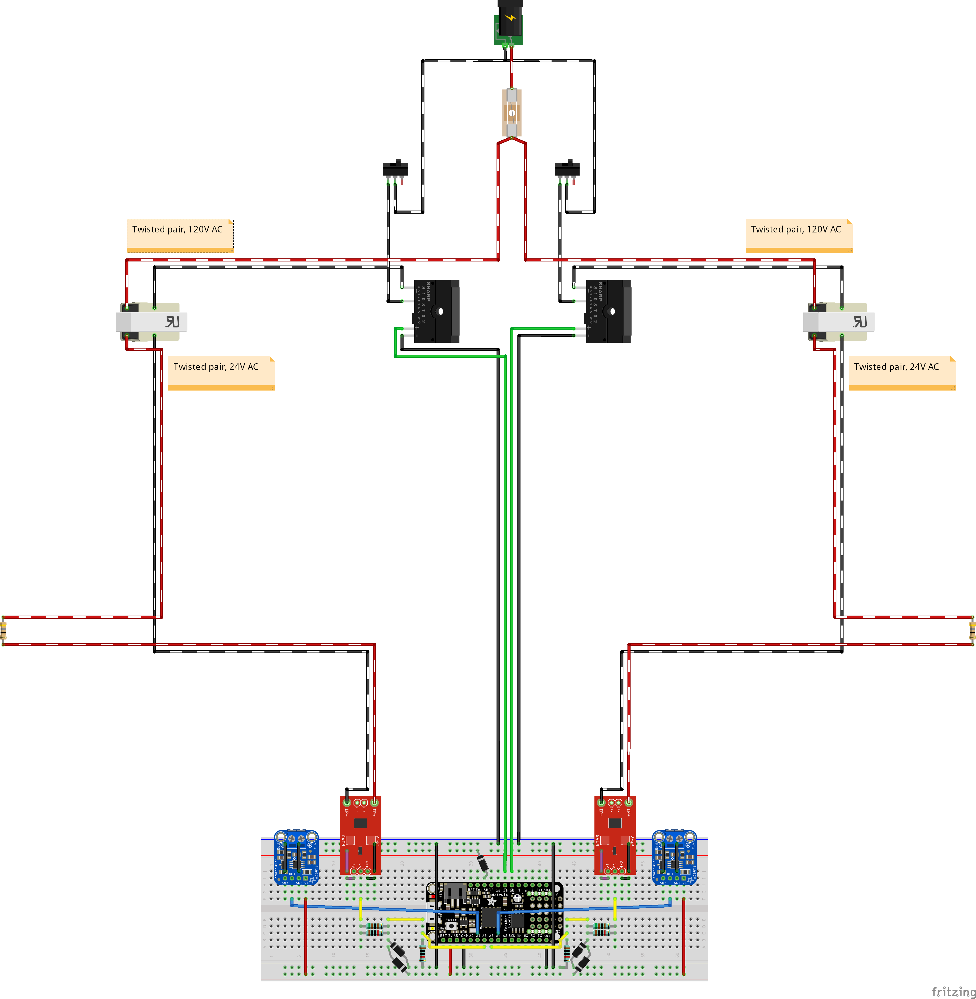

# DSC_v2

UI and real-time equipment control software for a Differential Scanning Calorimetry Prototype System, as part of my undergraduate physics research

This project version of the project is built for use with the **Adafruit Feather M0 Express**. For details about the original project, see [Previous Version](#previous-version).

NOTE: This project is currently a work-in-progress. Not all features have been implemented and all code may be subject to change.

## Contents

- [DSC_v2](#dsc_v2)
  - [Contents](#contents)
  - [Copyright Notice](#copyright-notice)
  - [Getting Started](#getting-started)
    - [Front End Development (MATLAB)](#front-end-development-matlab)
    - [Back End Development (Arduino)](#back-end-development-arduino)
    - [Editor Requirement & Recommendations](#editor-requirement--recommendations)
    - [Libraries](#libraries)
      - [Octave Packages](#octave-packages)
      - [MATLAB Libraries](#matlab-libraries)
      - [Arduino Libraries](#arduino-libraries)
    - [Arduino Board Packages](#arduino-board-packages)
  - [Usage Instructions](#usage-instructions)
    - [First-Time Arduino Setup Instructions](#first-time-arduino-setup-instructions)
    - [Experiment Instructions](#experiment-instructions)
    - [Data Analysis Instructions](#data-analysis-instructions)
    - [PID Tuning Instructions](#pid-tuning-instructions)
    - [Arduino NeoPixel Color Codes](#arduino-neopixel-color-codes)
  - [Hardware & Apparatus](#hardware--apparatus)
    - [Bill of Materials](#bill-of-materials)
    - [Circuit Diagram](#circuit-diagram)
  - [Previous version](#previous-version)

## Copyright Notice

DSC_v2: UI and control systems for DSC prototype system

Copyright (C) 2020 Christian Kunis

This program is free software: you can redistribute it and/or modify
it under the terms of the GNU General Public License as published by
the Free Software Foundation, either version 3 of the License, or
(at your option) any later version.

This program is distributed in the hope that it will be useful,
but WITHOUT ANY WARRANTY; without even the implied warranty of
MERCHANTABILITY or FITNESS FOR A PARTICULAR PURPOSE. See the
GNU General Public License for more details.

You should have received a copy of the GNU General Public License
along with this program. If not, see <https://www.gnu.org/licenses/>.

You may contact the author at ckunis.contact@gmail.com

## Getting Started

### Front End Development (MATLAB)

- Documentation TBD

### Back End Development (Arduino)

- Documentation TBD
  - TODO: Include instructions about what Arduino libraries are needed to run the program and how to install those libraries (either through the Arduino IDE or install manually)

### Editor Requirement & Recommendations

- **Front End:** Requires MATLAB version 2020b or later.
- **Arduino:** Recommended Arduino IDE 1.8 or later. Requires additional Arduino libraries, which are listed in the [Arduino Libraries](#arduino-libraries) section below.

### Libraries

#### Octave Packages

- [instrument-control](https://octave.sourceforge.io/instrument-control/index.html)

  Low level I/O functions for serial, i2c, spi, parallel, tcp, gpib, vxi11, udp and usbtmc interfaces.

  To install a package, use the `pkg` command from the Octave prompt by typing: `pkg install -forge -verbose instrument-control` Note: This package may take more than 30 minutes to compile and install.

#### MATLAB Libraries

- [INI Config](https://www.mathworks.com/matlabcentral/fileexchange/24992-ini-config)

  IniConfig is a MATLAB class for working with configurations of settings and INI-files.

  The necessary file `IniConfig.m` and the corresponding license file are including in the DSC project's root directory, and is automatically imported by the MATLAB App programs. **No further installation is needed**.

  > Evgeny Pr (2020). INI Config (<https://www.mathworks.com/matlabcentral/fileexchange/24992-ini-config>), MATLAB Central File Exchange. Retrieved August 4, 2020.
  >
  > > This class allows you to create configurations of settings, and to manage them.
  > > The structure of the storage settings is similar to the structure of the storage the settings in the INI-file format.
  > > The class allows you to import settings from the INI-file and to export the settings in INI-file.
  > > Can be used for reading/writing data in the INI-file and managing settings of application.

#### Arduino Libraries

- [Adafruit NeoPixel](https://github.com/adafruit/Adafruit_NeoPixel)

  Arduino library for controlling single-wire-based LED pixels and strip such as the [Adafruit 60 LED/meter Digital LED strip][strip], the [Adafruit FLORA RGB Smart Pixel][flora], the [Adafruit Breadboard-friendly RGB Smart Pixel][pixel], the [Adafruit NeoPixel Stick][stick], and the [Adafruit NeoPixel Shield][shield].

  See also: [Adafruit NeoPixel Überguide](https://learn.adafruit.com/adafruit-neopixel-uberguide)

[flora]: http://adafruit.com/products/1060
[strip]: http://adafruit.com/products/1138
[pixel]: http://adafruit.com/products/1312
[stick]: http://adafruit.com/products/1426
[shield]: http://adafruit.com/products/1430

- [AutoPID](https://r-downing.github.io/AutoPID/)

  AutoPID is an Arduino library that lets you easily setup PID controllers on the Arduino that run in the background. My DSC project relies heavily on all of the main features of this library, including "Time-scaling and Automatic Value Updating", "Bang-Bang Control", and "PWM (Relay) Control". See [here](https://r-downing.github.io/AutoPID/#about) for more details.

  Most importantly to this project, the "PWM (Relay) Control" feature allows the PID controller to automatically imitate a PWM output with a customizable _pulse width_ given in milliseconds. This is necessary for using the PWM output to control the Solid State Relays in our DSC circuit because the relays we use have a response time of 10ms, so we must use a PWM signal with a pulse width that is at least 10 times larger than this 10ms response time.

- [INA219_WE](https://www.arduino.cc/reference/en/libraries/ina219_we/)

  A library for the INA219 current sensor module
  It allows to set various ADC modes, gains and bus voltage ranges. Continous mode, triggered mode, power down and ADC off mode are supported.

- [pidautotuner](https://github.com/jackw01/arduino-pid-autotuner)

  Automated PID tuning using Ziegler-Nichols/relay method for embedded systems.

  Originally designed for Arduino and compatible boards, but does not rely on the Arduino standard library.

  **Note:** This library is included in the `libraries` folder of this repo, and must be manually added to your Arduino libraries. It is not available via the Arduino IDE library manager.

### Arduino Board Packages

- To use the Adafruit Feather M0 Express with the Arduino IDE, you will first need to add the following link into the **Additional Boards Manager URLs** option in the Arduino IDE preferences: `https://adafruit.github.io/arduino-board-index/package_adafruit_index.json`
- Refer to [these instructions](https://learn.adafruit.com/adafruit-feather-m0-express-designed-for-circuit-python-circuitpython/arduino-ide-setup) for details.

- The following package may be installed via the **Boards Manager** in the Arduino IDE:
  - **Arduino SAMD Boards**
  - **Adafruit SAMD Boards**

## Usage Instructions

### First-Time Arduino Setup Instructions

1. Follow [these instructions](https://learn.adafruit.com/adafruit-feather-m0-express-designed-for-circuit-python-circuitpython/arduino-ide-setup) to setup the Arduino IDE for use with the Adafruit M0 Express and install the required [Board Packages](https://learn.adafruit.com/adafruit-feather-m0-express-designed-for-circuit-python-circuitpython/using-with-arduino-ide).
2. Plug in the Feather M0 Express to the computer via a USB cable.
3. If you have not done so already, open the `dsc_arduino` sketch in the Arduino IDE and upload it to the Adafruit Feather M0 Express.
4. Make a note of which serial port the arduino board is connected to (Example: "COM3"), as you will need to set the same port in the experiment UI (the MATLAB program)

### Experiment Instructions

**Octave:** Run the file `dsc_octave_gui/run/runApp.m` in Octave to display the dev build of the Octave UI

Run the `DSC_Experiment_UI.mlapp` in MATLAB 2020b or later
(More detailed instructions coming in the future)

### Data Analysis Instructions

Run the `DSC_Data_Analysis_UI.mlapp` in MATLAB 2020b or later
(More detailed instructions coming in the future)

### PID Tuning Instructions

Please note: The instructions for manually tuning the PID controller gains will assume that you already know and understand the principles behind how PID control works, and an understanding of what each of the PID gains do. In the future, I hope to implement an algorithm for tuning the PID gains automatically, but this feature has been put on hold until the primary functionality of the hardware and software has been completed.

### Arduino NeoPixel Color Codes

For this program, I have taken advantage of the built-in NeoPixel LED on the Feather M0 Express to show the current status of the Arduino script. The color of this LED will indicate the current status or action being performed by the Arduino:

- **NeoPixel off, with pin 13 LED flashing**: Standby mode; the Arduino is awaiting instructions from the UI to be received via the serial bus.
- **Cyan**: Received a command to send/receive configuration parameters to/from the UI. These "configuration parameters" include the PID gain constants and/or temperature control parameters.
- **Blue**: Currently running the temperature control loop (i.e., the experiment procedure is in progress).
- **Green**: The temperature control loop has been completed successfully. This means the experiment procedure was successful,
- **Yellow**: The temperature of one or more sample(s) exceeded the max safety limit, so the system aborted the temperature control loop.
- **Red**: Received a "stop" command from the UI and successfully interrupted and aborted the temperature control loop.
- **Blue**: Received a newline char via the serial bus (meaningless command, no special action performed in response).

## Hardware & Apparatus

### Bill of Materials

- TBD

### Circuit Diagram

Work in progess...

    

## Previous version

[The retired version](https://github.com/NerdyGriffin/DSC_UI) was built for use with a NI USB-6211 DAQ Box, but was deemed incompatible with our intended use case due to the limitations of the USB-6211 DAQ Box hardware and the limitations of the features available in the [Data Acquisition Toolbox](https://www.mathworks.com/help/daq/) at the time. Specifically, the system could not support the ability to update the duty cycle of PWM output in realtime without stopping and restarting the PWM output and attempted workarounds for this issue were unstable and would interfering with the real-time input measurement and/or time (internal clock) measurement.
